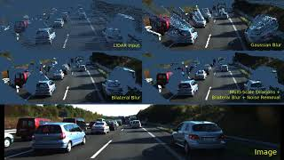
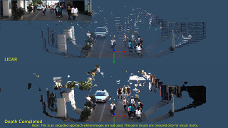

## Image Processing for Basic Depth Completion (IP-Basic)
Depth completion is the task of converting a sparse depth map D<sub>sparse</sub> into a dense depth map D<sub>dense</sub>. This algorithm was originally created to help visualize 3D object detection results for [AVOD](https://arxiv.org/abs/1712.02294).

An accurate dense depth map can also benefit 3D object detection or SLAM algorithms that use point cloud input. This method uses an unguided approach (images are ignored, only LIDAR projections are used). Basic depth completion is done with OpenCV and NumPy operations in Python. For more information, please see our paper: [In Defense of Classical Image Processing: Fast Depth Completion on the CPU](https://arxiv.org/abs/1802.00036).

Please visit [https://github.com/kujason/scene_vis](https://github.com/kujason/scene_vis) for 3D point cloud visualization demos on raw KITTI data.

If you use this code, we would appreciate if you cite our paper:
[In Defense of Classical Image Processing: Fast Depth Completion on the CPU](https://arxiv.org/abs/1802.00036)

```
@inproceedings{ku2018defense,
  title={In Defense of Classical Image Processing: Fast Depth Completion on the CPU},
  author={Ku, Jason and Harakeh, Ali and Waslander, Steven L},
  booktitle={2018 15th Conference on Computer and Robot Vision (CRV)},
  pages={16--22},
  year={2018},
  organization={IEEE}
}
```

### Videos
Click [here](https://www.youtube.com/watch?v=t_CGGUE2kEM) for a short demo video with comparison of different versions.

[](https://www.youtube.com/watch?v=t_CGGUE2kEM)
---
Click [here](https://youtu.be/tYwIcLvfC70) to see point clouds from additional KITTI raw sequences. Note that the structure of smaller or thin objects (e.g. poles, bicycle wheels, pedestrians) are well preserved after depth completion.

[](https://youtu.be/tYwIcLvfC70)
---
Also see an earlier version of the algorithm in action [here (2 top views)](https://www.youtube.com/watch?v=Q1f-s6_yHtw).

---
### Setup
[show_process]: images/show_process.png "Showing Process"
Tested on Ubuntu 16.04 with Python 3.5.
1. Download and unzip the KITTI depth completion benchmark dataset into `~/Kitti/depth` (only the val_selection_cropped and test data sets are required to run the demo). The folder should look like something the following:
  - ~/Kitti/depth
    - devkit
    - test_depth_completion_anonymous
    - test_depth_prediction_anonymous
    - train
    - val
    - val_selection_cropped

2. Clone this repo and install Python requirements:
```
git clone git@github.com:kujason/ip_basic.git
cd ip_basic
pip3 install -r requirements.txt
```

3. Run the script:
```bash
python3 demos/depth_completion.py
```
This will run the algorithm on the cropped validation set and save the outputs to a new folder in `demos/outputs`. Refer to the readme in the downloaded devkit to evaluate the results.

4. (Optional) Set options in `depth_completion.py`
- To run on the test set, comment the lines below `# Validation set` and uncomment the lines below `# Test set`
- `fill_type`:
  - `'fast'` - Version described in the paper
  - `'multiscale'` - Multi-scale dilations based on depth, with additional noise removal
- `extrapolate`:
  - `True`: Extends depths to the top of the frame and runs a 31x31 full kernel dilation
  - `False`: Skips the extension and large dilation
- `save_output`:
  - `True` - Saves the output depth maps to disk
  - `False` - Shows the filling process. Only works with `fill_type == 'multiscale'`
  ![alt text][show_process]

5. (Optional) To run the algorithm on a specific CPU (e.g. CPU 0):
```bash
taskset --cpu-list 0 python3 demos/depth_completion.py
```

### Results
#### KITTI Test Set Evaluation
|        Method |  `iRMSE` |   `iMAE` |    **RMSE** |      `MAE` |     `Device` |  `Runtime` |   `FPS` |
|:-------------:|:--------:|:--------:|:-----------:|:----------:|:------------:|:----------:|:-------:|
|     NadarayaW |     6.34 |     1.84 |     1852.60 |     416.77 | CPU (1 core) |     0.05 s |      20 |
|   SparseConvs |     4.94 |     1.78 |     1601.33 |     481.27 |          GPU | **0.01 s** | **100** |
|        NN+CNN | **3.25** | **1.29** |     1419.75 |     416.14 |          GPU |     0.02 s |      50 |
|  **IP-Basic** |     3.75 | **1.29** | **1288.46** | **302.60** | CPU (1 core) |    0.011 s |      90 |

Table: Comparison of results with other published unguided methods on the [KITTI Depth Completion benchmark](http://www.cvlibs.net/datasets/kitti/eval_depth.php?benchmark=depth_completion).

### Versions
Several versions are provided for experimentation.
- `Gaussian (Paper Result, Lowest RMSE)`: Provides lowest RMSE, but adds many additional 3D points to the scene.
- `Bilateral`: Preserves local structure, but large extrapolations make it slower.
- `Gaussian, No Extrapolation`: Fastest version, but adds many additional 3D points to the scene.
- `Bilateral, No Extrapolation (Lowest MAE)`: Preserves local structure, and skips the large extrapolation steps. This is the recommended version for practical applications.
- `Multi-Scale, Bilateral, Noise Removal, No Extrapolation`: Slower version with additional noise removal. See the [above video](https://www.youtube.com/watch?v=t_CGGUE2kEM) for a qualitative comparison.

#### Timing Comparisons
The table below shows a comparison of timing on an Intel Core i7-7700K for different versions. The Gaussian versions can be run on a single core, while other versions run faster with multiple cores. The bilateral blur version with no extrapolation is recommended for practical applications.

|                                                   Version |  Runtime | FPS |
|:---------------------------------------------------------:|:--------:|:---:|
|                  Gaussian (**Paper Result, Lowest RMSE**) | 0.0111 s |  90 |
|                                                 Bilateral | 0.0139 s |  71 |
|                                Gaussian, No Extrapolation | 0.0075 s | 133 |
|              Bilateral, No Extrapolation (**Lowest MAE**) | 0.0115 s |  87 |
|   Multi-Scale, Bilateral, Noise Removal, No Extrapolation | 0.0328 s |  30 |

Table: Timing comparison for different versions.

### Examples
Qualitative results from the `Multi-Scale, Bilateral, Noise Removal, No Extrapolation` version on samples from the KITTI object detection benchmark.
#### Cars
[sample_006338]: images/006338/006338.png "Sample 006338"
[lidar_006338]: images/006338/lidar.png "Colourized LIDAR points"
[completed_006338]: images/006338/completed.png "Points after depth completion"
- Image:
    ![alt text][sample_006338]
- Colourized LIDAR points (showing ground truth boxes):
    ![alt text][lidar_006338]
- After depth completion (showing ground truth boxes):
    ![alt text][completed_006338]

#### People
[sample_000043]: images/000043/000043.png "Sample 000043"
[lidar_000043]: images/000043/lidar.png "Colourized LIDAR points"
[completed_000043]: images/000043/completed.png "Points after depth completion"
- Image:
    ![alt text][sample_000043]
- Colourized LIDAR points (showing ground truth boxes):
    ![alt text][lidar_000043]
- After depth completion (showing ground truth boxes):
    ![alt text][completed_000043]
